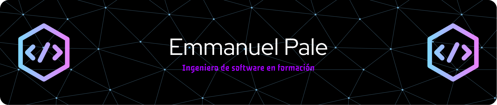

  

## 🚀 Sobre mí

- 🎒​ Estoy estudiando la carrera de Ingeniería de Software
- 🔭 Actualmente trabajando en mi próximo proyecto móvil. Próximamente más información.
- 🌱 Aprendiendo flutter y Dart para desarrollo multiplataforma.

## 🛠️ Tecnologías y Herramientas

### Lenguajes de Programación

### Frameworks y Librerías

### Herramientas y Plataformas

## 📊 Estadísticas de GitHub

  

  

## 🔥 Racha de Contribuciones

  

## 🎯 Proyectos Destacados

## 🌐 Conecta conmigo

  

  
  **¡Gracias por visitar mi perfil! 🚀**
  

